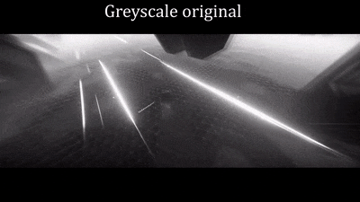

# Automatic Temporally Coherent Video Colorization

 

Credits for the example in the gif above: JUGZ

## Setup

`conda env create`

Also note that some of the scripts depend on `ffmpeg`.

## Train a model on a folder of PNG frames

`python -m tcvc.train --dataset-path /path/to/images/ --input-style line_art`

or

`python -m tcvc.train --dataset-path /path/to/images/ --input-style greyscale`

The frame filenames should have zero-padded frame numbers, for example like this:

* frame00001.png, frame00002.png, frame00003.png, ...

If you have multiple sequences of frames (i.e. from different videos/scenes/shots), you can have different prefixes in the frame filenames, like this:
* firstvideo00001.png, firstvideo00002.png, firstvideo00003.png, ..., secondvideo00001.png, secondvideo00002.png, secondvideo00003.png, ...

Alternatively, the different frame sequences can reside in different subfolders. For that to work, you have to use the `--include-subfolders` argument.

## Apply video colorization to a folder of PNG frames

If you have a video file, not a set of PNG frames, you can run `python -m tcvc.extract_video_frames --input-path /path/to/video.mp4` to extract the frames as a set of images.

Once you have a folder that contains video frames that you want to colorize, run the following command:

`python -m tcvc.apply --input-path /path/to/frames/ --input-style line_art`

By default, this command will use a model that is included in this repository. It is trained on Dragonball line art. If you want to specify a different model, you can do that with `--model`. For example, you could try this model that is trained on Ninjadev demos:

https://github.com/iver56/automatic-video-colorization/releases/download/ninjadev/netG_ninjadev_weights_epoch_4.pth

Remember that this model expects you to use `--input-style greyscale`.

`tcvc.apply` will scale your frames to 256x256. In order to apply the color of the small 256x256 frames to the corresponding higher-resolution original greyscale frames, run `python -m tcvc.transfer_colored_frames --input-path /path/to/frames`.

Note: `--input-path` here refers to the path to the folder that contains the greyscale images (frames) and a subfolder named "colored" where the corresponding colored frames reside.

Once you have the set of frames you want in a video, you can run `python -m tcvc.convert_images_to_video --framerate 30 --input-path /path/to/frames --audio-path /path/to/original_video_file.mp4` to compile a video file. Alternatively, you can use `ffmpeg` directly.

## But 256x256 is too blurry for me :(

There is some experimental code that uses noise2noise techniques to upscale and refine the 256x256 outputs. See [resolution_enhancer](https://github.com/iver56/automatic-video-colorization/tree/master/resolution_enhancer)

## Run tests

`pytest`

## Licence and attribution

Credits go to [Harry-Thasarathan/TCVC](https://github.com/Harry-Thasarathan/TCVC). Changes made to the original can be found in the [commit history](https://github.com/iver56/automatic-video-colorization/commits/master). See also [the licence](https://github.com/iver56/automatic-video-colorization/blob/master/LICENCE.md).

The original paper by Harrish Thasarathan, Kamyar Nazeri and Mehran Ebrahimi (2019) can be read at [https://arxiv.org/abs/1904.09527](https://arxiv.org/abs/1904.09527).

## Known issues

* The code is not compatible with CPU mode as of 2019-06-21
